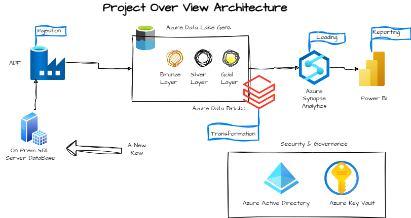

# End-to-End-Azure-Project-01
## Overview
This project outlines the development of a robust Azure data engineering solution, designed to efficiently ingest, transform, load, and analyze data. By leveraging key Azure services, I have created a scalable and secure data platform that supports critical business insights.

## The tools that are covered in this project are

Azure Data Factory

Azure Data Lake Storage Gen2

Azure Databricks

Azure Synapse Analytics

Azure Key vault

Microsoft Entra ID (Previously called as AAD) and

Microsoft Power BI

## Architecture

## Summary

### Data Flow

- Ingestion: Azure Data Factory extracts data from an on-premises SQL Server database and loads it into Azure Data Lake Storage Gen2.
- Transformation: Azure Databricks is used to clean, normalize, and enrich the raw data, preparing it for analysis.
- Loading: The transformed data is loaded into Azure Synapse Analytics for efficient querying and reporting.
- Reporting: Microsoft Power BI connects to Azure Synapse Analytics to create interactive dashboards, providing valuable insights into business metrics.
### Pipeline Testing
- To ensure data quality and integrity, we've implemented a comprehensive pipeline testing process that covers:

- Data Ingestion: Verifying the successful transfer of data from the source system.
- Data Transformation: Validating the accuracy and consistency of data transformations.
- Data Loading: Checking the completeness and correctness of data in the target storage.
- Reporting: Ensuring that the Power BI dashboard reflects the latest data and provides accurate insights.
### Benefits

- Scalability: The solution can easily accommodate growing data volumes and increasing analytical demands.
- Security: Azure's built-in security features protect sensitive data and prevent unauthorized access.
- Efficiency: Automation and optimization of data pipelines reduce manual effort and improve performance.
- Flexibility: The modular design allows for easy customization and integration with other systems.

